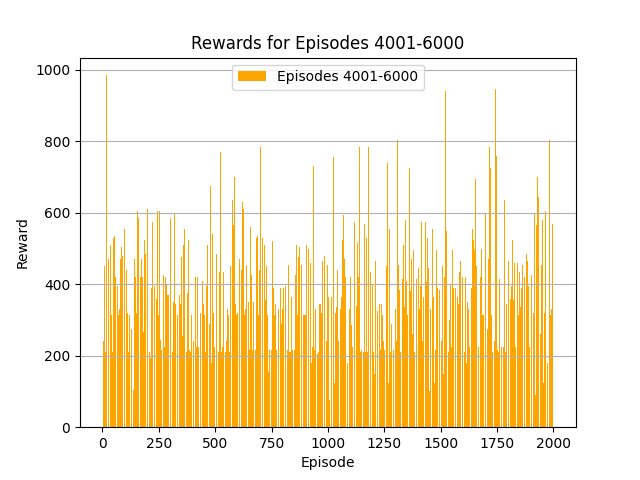
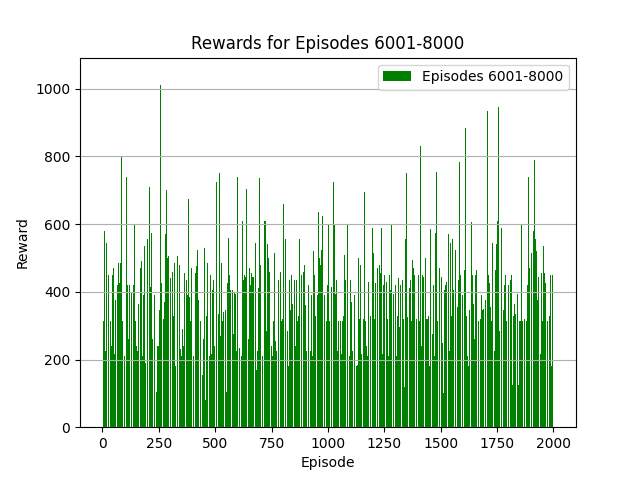
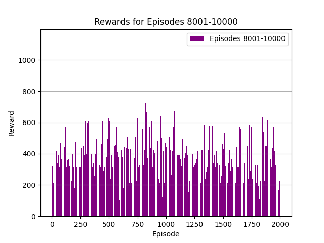

# Projektöversikt

Detta projekt handlar om att utveckla en AI-agent med Deep Q-Learning (DQN) för att spela Atari 2600-spelet "Space Invaders". Syftet är att skapa en agent som kan maximera sina belöningar genom att fatta intelligenta beslut baserade på tidigare erfarenheter. För att uppnå detta har jag använt Gymnasium-ramverket och integrerat flera tekniker som är specifikt anpassade för detta problem.

Uppgiften har varit att arbeta med ett spel SpaceInvaders. Detta spel kräver att agenten förstår vad som sker på skärmen och reagerar på lämpligt sätt. För att minska beräkningskostnaderna och göra uppgiften hanterbar. Arbetas observationerna genom att förminska dem till (84, 84) pixlar och konvertera dem till gråskala. Dessutom staplas fyra bilder för att ge agenten en tidskänslig uppfattning om spelets dynamik.

För att hantera data på ett effektivt sätt används en Replay Buffer med en kapacitet på 100 000 övergångar. Detta val baseras på behovet av att ha tillgång till tillräckligt många varierade scenarier under träningen och även funkade best för min modell på den tiden jag hann testa. Bufferten lagrar övergångar i form av tillstånd, handlingar, belöningar, efterföljande tillstånd och avslutande signaler. Dessa data samplas sedan slumpmässigt för att bryta korrelationer och göra träningen stabilare.

Arkitekturen inkluderar tre konvolutionella lager som extraherar viktiga egenskaper från spelmiljöns bilder, följt av fullt anslutna lager som lär sig att värdera olika handlingar. ReLU aktiveringsfunktion används för dess enkelhet och effektivitet. Adam-optimeraren med en lärandehastighet på 0.0001 valdes för att balansera snabb konvergens med stabil träning. Gradientklippning med en maxnorm på 1 implementerades för att förhindra instabilitet.

Hyperparametrarna valdes med testing och dessa som jag hadei slutet var de som gav mig bäst. Diskonteringsfaktorn (γ) är satt till 0.99 vilket funkade bäst för Ai:n. Utforskningsstrategin använder epsilon-greedy, där epsilon börjar vid 1.0 och gradvis minskar till 0.01 under en miljon steg. Detta ger agenten möjlighet att utforska olika handlingar i början och sedan fokusera på handlingarna senare.

Träningsprocessen är försökt designad för att maximera lärande och stabilitet. Agenten börjar lära sig efter att Replay Buffern har fyllts med minst 10 000 övergångar, vilket säkerställer att det finns tillräckligt med data för att påbörja meningsfull träning. Under träningen används en batchstorlek på 64 och Replay Buffern samplas var fjärde steg. Målnätverket uppdateras var 1 000:e bildruta för att ge stabila målvärden och förhindra att träningen blir instabil.

Testing sker efter att modellen har tränats klart. Agentens prestation utvärderas över 10 episoder där den totala belöningen spåras för att bedöma hur väl agenten presterar.

Under designen har jag tagit hänsyn till faktorer som effektivitet och precision. Genom att använda mixed-precision träning via torch.amp.GradScaler minskar beräkningskostnaderna på moderna GPU:er samtidigt som resultatet blir korrekt.

# Data utforskning
Datautforskning

Jag har även gjort lite dataanalys. Här kan vi se högsta, minsta, medelvärde och standardavvikelse:

-Max: 1140.0

-Min: 5.0

-Medelvärde: 391.43

-Standardavvikelse: 153.79

Från denna information kan vi dra slutsatsen att AI:n blir bättre över tid, men nådde AI:n sin högsta punkt av slump, eller finns det ett samband med specifika scenarier?

Maxresultatet är imponerande, men minimivärdet visar att vissa episoder fortfarande går dåligt. Detta kan bero på tidiga episoder med hög ε-värde (epsilon). Egentligen borde man kanske exkludera dessa episoder för att få mer säker data.

Jag kommer även att gå igenom bilder på hur träningen har sett ut i form av plots. Man kan se en viss förbättring och försämring på vissa fronter:

I början kan man se hur agenten startar upp och blir ganska bra rätt snabbt. Det ger en bra indikation på att den har lärt sig något som fungerar och bygger vidare på detta. Dock kan man se att de andra fyra bilderna ser ganska lika ut. Detta får mig att fundera på om modellen har blivit overfit genom att göra samma sak för att få belöningar. Mellan bild 2 och 5 ser vi dock att de högsta topparna minskar medan de lägsta topparna höjs. Kan det vara så att agenten blir mer säker på sin strategi?

En normaliserad bell plot visar att belöningarna är normalfördelade, vilket är förväntat med tillräckligt många episoder. Dock sticker en stapel ut innan en tydlig dipp. Detta kan tyda på antingen tur i en episod eller att en ny strategi testades som sedan övergavs.

Vi kan även se i våra kumulativa belöningar att den går stadigt uppåt under hela träningen. Detta kan vara bekymmersamt. Har modellen fastnat i en overfit? Om vi tittar tillbaka på resultaten kan det kanske stämma. Den blir bra rätt snabbt men visar inte mycket förbättring efter cirka 6000 episoder. Vad kan ha gått fel, eller är jag förskeptisk och letar efter en overfit när det egentligen inte finns en?

# Slutsats

Träningen av modellen tog endast 8 timmar att genomföra på min NVIDIA 4080 Super GPU.

Projektet har visat att det är möjligt att utveckla en effektiv AI-agent med DQN för Space Invaders. Agenten demonstrerar tydlig förbättring över tid och kan anpassa sig till spelets dynamik. Arkitekturen och hyperparametrarna har varit nyckeln till att uppnå stabilitet och effektivitet i träningen.

Trots framgångarna finns det indikationer på att agenten kan ha fastnat i en lokal strategi som ger tillräckliga belöningar men inte maximalt utnyttjar spelmöjligheterna. Vidare experiment med utforskning och justering av epsilon-strategin kan ge mer insikt.

Datavisualiseringarna har gett en tydlig bild av prestationerna, och framtida arbete kan fokusera på att förbättra generaliseringen och minska eventuell överanpassning. Detta inkluderar att exkludera tidiga episoder från analysen och att testa mer varierade scenarier.

Sammanfattningsvis är projektet ett starkt exempel på hur DQN kan tillämpas i spelmiljöer och lägger en stabil grund för vidareutveckling.